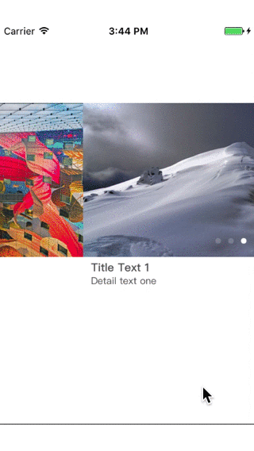

# scrollView
无限轮播 ScrollView

## Requirements

It requires `iOS 8.0+`  and `Swift 3.0+` .


## Installation


### Manually

You can install it manually just draging [scrollView](https://github.com/Memory2014/scrollView) to your project. 

## Usage


### From Code

Create a new `scrollView`.

**scrollView**:
```swift
        let imageArray: [String?] = ["1","2","3"]  // you can set image url, then modify the function setScrollViewOfImage
        
        let textArray : [String?] = ["Title Text 1","Title Text 2","Title Text 3"]
        let nameArray : [String?] = ["Detail text one","Detail text two","Detail text three"]
        
        self.adPageScrollView = PageScrollView(frame: CGRect(x: 0, y: 100, width: self.view.frame.size.width, height: self.view.frame.size.width*3/5 + 40 ), imageArray: imageArray, textArray: textArray, nameArray: nameArray)
        self.adPageScrollView.delegate = self
        
        self.view.addSubview(self.adPageScrollView)
```

**Degetage**:
```swift
    func clickCurrentImage(_ currentIndxe: Int) {
        print(currentIndxe, " click"); 
        //do what you want 
    }

```
And this is all.
